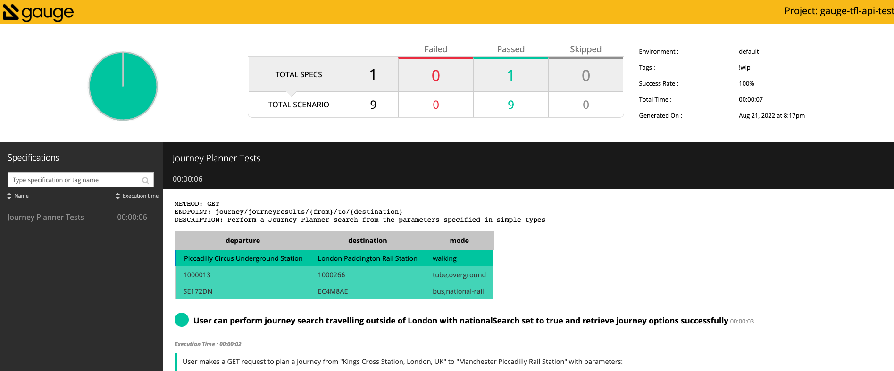
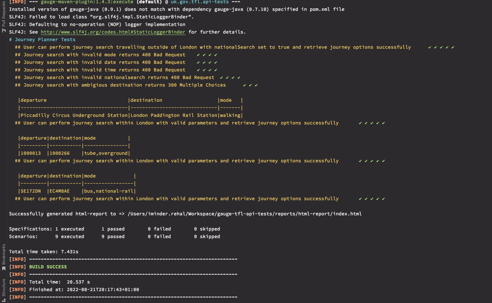

# Transport for London Tests

BDD tests for Transport for London APIs.


## Project Dependencies
- Java 11
- Maven
- Gauge - see [instructions](https://docs.gauge.org/getting_started/installing-gauge.html) for installation
- Gauge IDE Plugin - available for [vs code](https://marketplace.visualstudio.com/items?itemName=getgauge.gauge) and [intelliJ](https://plugins.jetbrains.com/plugin/7535-gauge)

## Approach
- I started off by looking at the documentation available for TfL APIs. They are well documented and easy to 
  follow. There was a postman collection available to download, which I used as the basis for my exploration. See 
  [postman collection](Transport For London.postman_collection.json) for requests.
- After understanding the functionality of the Journey Planner API, I created an outline of the scenarios required as 
  per the task.
- Once the scenarios were written, I decided on the framework to create executable specs.

### Exploring and findings
I focused and explored the following areas during testing:
  
- What is the functionality of the journey planner api?
  - The functionality overall is quite simple in that you can plan for a journey from point A to point B. What makes 
    it complex are the search parameters, and the varied data returned in the response.
- Am I able to plan a journey as specified in the task and get back valid results?
  - Once I was able to understand the input parameters, I tried performing journey searches from within London and 
    outside, but I was getting 300 Multiple Choices returned. These were redirects to potential matches to the 
    journey departure and destination points. To get actual journeys in the response I needed specific location data.
  - I searched for specific location data in the formats accepted by the API to perform more specific searches and 
    get the results required.
- Depending on the search parameters, what are the responses returned?
  - I had learned that if the input parameters were not specific enough, a redirect response was returned
  - I tested the validation on the key input parameters I was using. I didn't explore all the parameters, but the 
    key ones required to fulfill the task such as time, date, journey preference and mode. 
  - As I tested my assumptions and documented the responses and error messages. Not entirely BDD, as the 
    functionality is already there. I suppose you can say it was reverse engineering BDD!
- What are the dependencies?
  - Based on the documentation, I signed up to create a token for the `app_key` parameter, however I found later 
    that this was only necessary to allow up to 500 requests per minute.
- Assumptions
  - Given the nature of the API and data returned, I have made the assumption that the data is likely to change even 
    with fixed input parameters. For example the journey data could return more, less, or different results if the 
    data for point A to point B is ever updated.
  - Based on the above assumption, I decided to create checks that were not too specific that would cause the 
    automated tests to be brittle and break, but enough to cover the functionality and desired behaviour. For 
    example, I'm checking that for valid `from` and `to` parameters that there is at least one journey option 
    returned, and that there is at least one match returned from the modes provided.

## Automation
Gauge is a lightweight test automation tool that allows you to write test cases in business language. It is quite 
similar to Cucumber, but better in my opinion as it has a lot of features such as data persistence, reporting, and a 
test runner built in. 

It is also very customizable, and you can build your own specific framework features using the interfaces 
available.

I decided to use Gauge to implement the scenarios in the form of executable specifications.

For more information on gauge, see the [documentation](https://docs.gauge.org/index.html).

### Framework
Libraries used:

- Unirest for http requests
- AssertJ for assertions

### Design Approach
- See structure below:

```
├── env
│   └── default
│       ├── default.properties
│       ├── java.properties
├── reports
├── specs
│   └── JourneyPlanner.spec
├── src
   └── test
       ├── java
       │   ├── http
       │   │   ├── JourneyPlannerRequests.java
       │   │   └── Requests.java
       │   └── steps
       │       ├── JourneyPlannerAssertionSteps.java
       │       └── JourneyPlannerSteps.java
       └── resources
           └── schema.json
```

Directory guide:

`env` - holds environment property files
`specs` - directory contains executable specs
`reports` - html report

### Additional implementation
- I've made some scenarios data driven to test various input parameter types.
- I also made a start at implementing scenario `GET to journey/journeyresults returns response valid against schema` 
  to test the response against a valid schema. This test is failing (tagged as wip) as the schema is not quite 
  complete. I wasn't able to find a complete schema to use as reference as the documentation provides many schemas that make 
  up the journey results response, and it meant building this up by hand (lots of copying and pasting).

### Running tests
- To execute all the tests, run `mvn clean test`
- To execute all tests that are not tagged as wip (work in progress), run `mvn clean test -Dtags='!wip'`

### Results
The results can be found in the `reports` directory. See below for results:

Gauge report summary:


Terminal execution:


You can also see the tests running as part of github actions [here](https://github.com/imindersingh/gauge-tfl-api-tests/actions/workflows/main.yml).

## Improvements
- Test scenario with an ambiguous search and then following the redirect urls provided to a valid search 
  response.
- Add additional negative scenarios for invalid search parameters
- As a client of the TfL APIs, consider implementing contract tests  
- Finish implementation for schema validation test.
  - Ideally we'd want to dynamically pull the schema from a source to ensure we were always testing against the 
    latest version